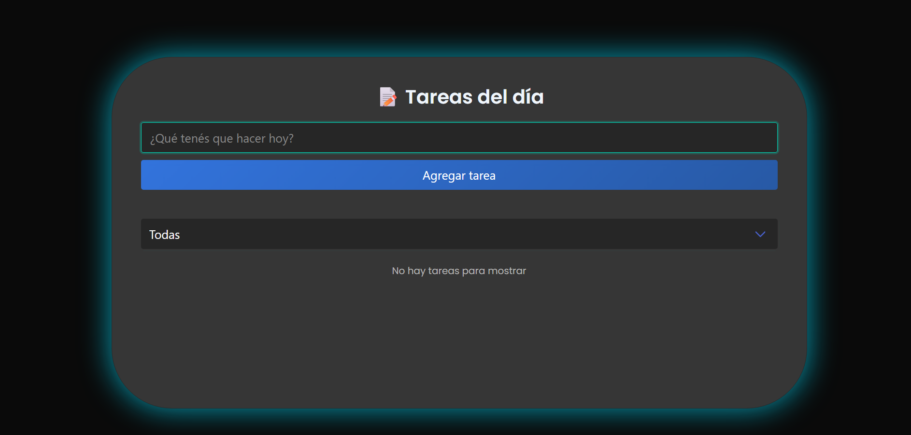
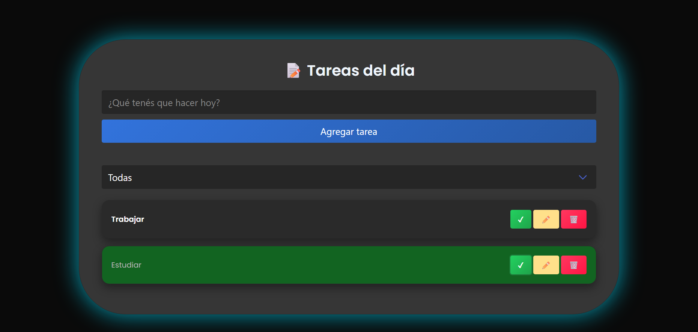
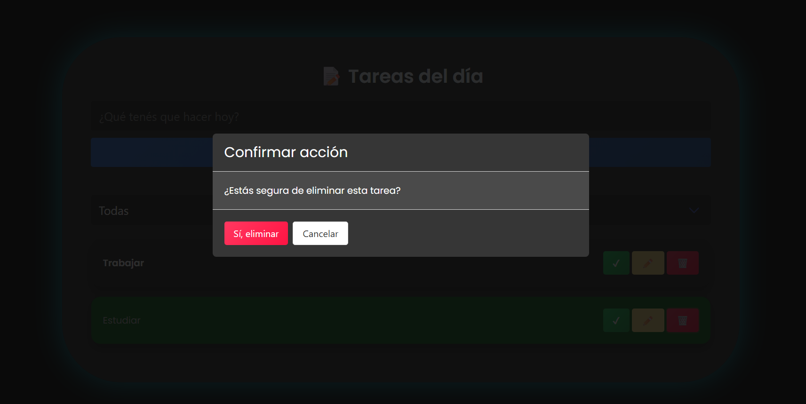

# ✅ Todo List App – React + Bulma

Aplicación de lista de tareas hecha con **React** y **Bulma**. Permite agregar, completar y eliminar tareas de forma sencilla. Incluye un tema oscuro para una mejor experiencia visual.

---

## ✨ Características

- ➕ Agregar tareas
- ✏️ Editar tareas existentes
- ✅ Marcar tareas como completadas
- 🗑️ Eliminar tareas
- 🔍 Filtrar tareas (todas / pendientes / completadas)
- 💾 Persistencia con **localStorage**
- 🌙 Diseño oscuro con bordes de color
- 📱 Responsive (desktop y mobile)

---

## 🛠️ Tecnologías utilizadas

- **React.js**
- **Bulma (CDN)**
- **CSS personalizado**
- **JavaScript (ES6+)**
- **localStorage**
- **HTML**
- **CSS**
- **Vite**

---
## ⚙️ Funcionalidades

- Agregar nuevas tareas con validación de datos.
- Editar tareas existentes.
- Marcar tareas como completadas.
- Eliminar tareas con confirmación visual.
- Filtrar tareas:
  - Todas
  - Completadas
  - Pendientes
- Persistencia de datos mediante localStorage : Las tareas se almacenan en el navegador utilizando      **localStorage**. Al recargar la página, la información se mantiene sin pérdida de datos.
- Interfaz responsive (mobile / desktop)
- Feedback visual al usuario ante acciones importantes

---

## 📂 Estructura del proyecto

El código fuente está organizado dentro de la carpeta `src/`:

- **components/**  
  Contiene los componentes reutilizables de la aplicación:  
  - `Form.jsx`: formulario para agregar nuevas tareas.  
  - `Todo.jsx`: representa una tarea individual.  
  - `TodoList.jsx`: muestra la lista completa de tareas.  
  - `ConfirmModal.jsx`: modal de confirmación para acción de eliminado de tareas.

- **App.jsx**  
  Componente principal que integra y coordina todos los demás.

- **main.jsx**  
  Punto de entrada de la aplicación, donde se inicializa React y se renderiza `App`.

- **index.css**  
  Archivo de estilos globales que aplica diseño a toda la aplicación.

---

## 🚀 Instalación y uso local

- `git clone https:` https://github.com/AndreAmutio/React-todo-app
- `cd todo-list-react`
- `npm install`
- `npm run dev` 

**Abrir en el navegador:** http://localhost:5173 

---

## 🖼️ Capturas de pantalla

### Vista principal

### Tareas completadas

### Editar tarea

---

## ✨ Mejoras UX implementadas

- Diseño oscuro con contraste visual para mejorar la legibilidad
- Resaltado visual de tareas completadas
- Animaciones sutiles al interactuar con las tareas
- Confirmación visual al eliminar tareas (modal)
- Inputs con feedback visual y validaciones claras
- Tipografía moderna y jerarquía visual

---

## 🌐 Deploy

Aplicación deployada en:  https://react-final-app-two.vercel.app/